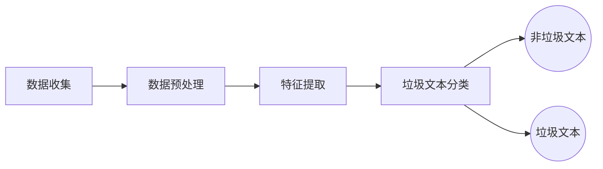
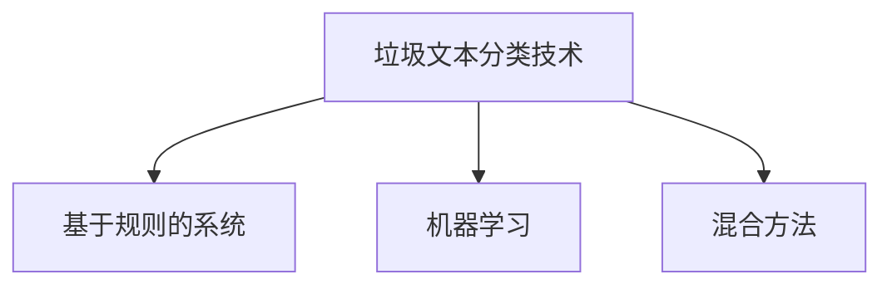

# 垃圾文本检测背景知识

垃圾文本检测是一种自然语言处理领域的任务，主要用于识别和过滤文本中的垃圾或其他不需要的信息。文本检测处理流程图如下： 



## 数据收集

需要收集包含正常和垃圾文本的大量数据样本，以建立一个全面的训练集。例如：

- Enron-Spam 数据集：该数据集是从 Enron 公司的电子邮件流量中收集而来，可用于垃圾邮件检测的训练和评估，涵盖各种主题和领域，包含了 13496 封垃圾邮件和 16545 封正常邮件。
- Chinese Text Classification 数据集：该数据集是一个中文类型的垃圾短信文本数据集，总共包含了 20 万条新闻标题。正样本标签为 1，表示垃圾短信；负样本标签为 0，表示正常短信。
- Twitter Social Honeypot 数据集：该数据集主要用于研究社交媒体的滥用和欺诈行为，包含了 22223 名垃圾邮件发送者和 19276 名正常邮件发送者，可用于对用户性质进行划分，判断用户是否为垃圾邮件的发送者。

## 文本检测数据预处理

对收集到的文本数据进行预处理，目的是将原始的文本数据进行抽取、过滤、去重等处理，使其适合机器学习模型的输入，且有助于提高模型性能。主要的数据预处理方法包括如下几个方面：

1. 文本数据清洗
2. 处理缺失值或异常值
3. 标记化
4. 移除停用词

### 文本数据清洗

文本数据通常包含各种噪音和无用信息，会对模型的分析和应用产生干扰，例如 HTML/XML 标记、标点符号、数字等。

- 对于 HTML/XML，用于网页结构的标签通常需要完全移除
- 中英文标点、特殊符号，可能干扰文本分析。纯数字或数字混合内容，根据场景决定是否保留。

可以利用正则表达式和字符串操作来去除噪音和无用信息，正则表达式匹配除了中文、英文、数字和空格之外的所有字符。

- 清洗后的文本可能并不利于阅读，需要进行“断文识字”，才能让计算机从实体词中学习到特征词。
- 此外，基于句子的整体含义进行分析是另一种处理流程和方法，是更加高级的处理方式。

### 处理缺失值或异常值

处理任何文本中的缺失值或异常值，以确保模型训练的稳定性。中文文本通常不存在数值缺失问题，但会存在空白文本、错误编码、意外字符等异常情况，这些会影响模型训练效果。例如：

```python
def handle_missing_values(text):
    if text.strip() == "":
        return '文本缺失'
    else:
        return text.strip()

# 示例文本
chinese_text = " 这是用于示例文本包含标点符号如逗号句号"
print("原始文本: ", chinese_text)

# 处理缺失值
cleaned_text = handle_missing_values(chinese_text)
print("处理后的文本: ", cleaned_text)
```

这个示例是文本预处理中最基础的空白文本处理逻辑，实际场景中还可以拓展处理错误编码、乱码、特殊字符等更复杂的异常情况。

### 标记化

标记化将文本分割为单个单词或标记，形成模型能够理解的基本单位。这是构建词袋模型或序列模型的基础，当对中文文本进行标记化时，通常会使用分词工具，如 jieba 库。

```python
import jieba

def tokenize_chinese_text(text):
    # 使用 jieba 进行分词
    words = jieba.lcut(text)
    return words

# 示例文本
chinese_text = "这是一个用于示例的文本包含了标点符号如逗号句号"
print("原始文本：", chinese_text)

# 标记化文本(分词)
tokenized_text = tokenize_chinese_text(chinese_text)
print("标记化后的文本：", tokenized_text)
```

分词结果如下：

```python
标记化后的文本：['这是', '一个', '用于', '示例', '的', '文本', '包含', '了', '标点符号', '如', '逗号', '句号']
```

可以发现分词后并不是每个词都具有重要信息，如被分割后的“这是” “的”“用于”，因此需要区分并进一步在预处理中移除没有实际意义的词。

### 移除停用词

停用词是在文本中频繁出现但通常没有实际意义的词语，移除这些停用词有助于减少特征空间的维度，并提高模型的效率。常见的中文停用词库包括但不限于如下四个：

1. 哈工大停用词表

2. 百度停用词表

3. 中文停用词表（SMART）

4. SCU（四川大学）停用词表

可以利用已有的停用词文件，将其转换为 Python 列表的形式，以过滤掉文本中出现的停用词。

```python
import jieba
# 读取停用词表文件，将停用词存储到列表中
stopwords_file = 'path/to/your/stopwords.txt'  # 替换为停用词表文件路径
with open(stopwords_file, 'r', encoding='utf-8') as file:
    stopwords = [line.strip() for line in file]

# 示例文本
chinese_text = "这是一个用于示例的文本包含了标点符号如逗号句号"
print("原始文本：", chinese_text)

# 使用停用词表进行分词并过滤停用词
words = jieba.lcut(chinese_text)
filtered_words = [word for word in words if word not in stopwords]

# 输出去除停用词后的文本
filtered_text = "".join(filtered_words)
print("去除停用词后的文本：", filtered_text)
```

也可以自己建立停用词表过滤停用词：

```python
import jieba
def remove_stopwords(text):
    # 停用词列表，根据需求添加
    stopwords = set(['的','了','在','是','我','有','和','就','不','人','都','一','一个','上','也','很','到','说','要'])

    # 对文本进行分词
    words = jieba.lcut(text)
    # 去除停用词
    filtered_words = [word for word in words if word not in stopwords]
    # 返去除停用词后的文本
    return "".join(filtered_words)

# 示例文本
chinese_text = "这是一个用于示例的文本包含了标点符号如逗号句号"
print("原始文本：", chinese_text)

# 去除停用词后的文本
filtered_text = remove_stopwords(chinese_text)
print("去除停用词后的文本：", filtered_text)
```

## 文本特征提取

在文本处理中，特征提取是将文本数据转换为可供机器学习算法使用的数字形式的过程，这个过程可以帮助算法更好地理解和处理文本数据。

### 文本特征提取目的

1. 降维和解决稀疏性问题：将原始的高维文本数据转换为更低维度的表示，减少模型的计算负担和存储需求，同时防止出现维度灾难。

2. 提取关键信息：从文本中提取与任务相关的关键信息，以便模型能够更好地理解和推断。

3. 增强模型性能：提取更具代表性的特征有助于提高模型的性能，使其更好地适应于文本检测任务。

### 文本特征提取步骤

首先获取每个字的嵌入向量，然后将这些字级别的信息整合成句子级别的特征表示。

#### 字符表征

词嵌入是将文本中的单词，映射到固定长度的稠密向量的技术，也是现代 NLP 模型的基础。向量的每个维度都编码了单词的语义、情感、语法等特征，语义相近的词，向量在空间中也会更接近。

1. 大部分自然语言处理模型的有效性来自单词嵌入，这些嵌入携带着单词的含义和情感等特征。

2. 字符表征考虑了单个字符的语义和情感信息，这意味着即使单个字符没有被正确拼写，模型也需要能捕捉到重要的语义特征。（即它把单词拆成字母 / 字符，逐个编码再组合；拼写错了，整体 “字符序列特征” 仍然和正确词很像，向量距离近，语义就能被捕捉到）

#### 文本句子表征

在获取每个字的嵌入向量后，需要将这些字级别的信息整合成句子级别的特征表示。在自然语言处理中，包括但不限于以下几种流行的方法： 

1. 平均值法：通过计算句子中所有字嵌入向量的平均值来得到句子的表示。

2. 长短期记忆网络：网络会逐字读取句子，并在每一步更新其隐藏状态。句子的最终表示可以是最后一个字的隐藏状态，或者是整个序列隐藏状态的某种组合。

3. 自注意力机制：通过计算句子中各个字之间的关系来获得句子表示。这种方法特别有利于捕捉句子内部的复杂依赖关系。

| 方法名称                   | 核心思想                                                     | 优点                                                         | 缺点                                                         | 适用场景                                                     | 技术特点                                                     |
| -------------------------- | ------------------------------------------------------------ | ------------------------------------------------------------ | ------------------------------------------------------------ | ------------------------------------------------------------ | ------------------------------------------------------------ |
| **平均值法**               | 计算句子中所有字嵌入向量的算术平均值作为句子表示。           | 1. 实现简单，计算高效 2. 无需额外模型训练                     | 1. 忽略字的顺序和结构信息 2. 无法捕捉复杂语义关系             | 对计算资源敏感或对语义精度要求不高的简单任务（如快速文本分类） | 无模型参数，纯统计方法                                       |
| **长短期记忆网络（LSTM）** | 通过逐字处理序列并更新隐藏状态，最终用最后时刻或组合的隐藏状态表示句子。 | 1. 捕捉序列顺序和长距离依赖关系 2. 适合动态变化的序列数据     | 1. 计算复杂度较高 2. 难以并行处理 3. 可能遗忘早期信息（梯度消失） | 需要建模时序信息的任务（如文本生成、情感分析、命名实体识别） | 属于循环神经网络变体，含门控机制                             |
| **自注意力机制**           | 通过计算字与字之间的相关性权重，动态聚合所有字的嵌入信息生成句子表示。 | 1. 捕捉全局依赖和复杂语义关系 2. 支持并行计算 3. 灵活关注关键信息 | 1. 计算资源消耗大（尤其长文本）2. 需要大量数据训练           | 需要深度语义理解的复杂任务（如机器翻译、问答系统、文本摘要） | 基于 Transformer 架构，核心为 Query-Key-Value 矩阵运算和多头注意力机制 |

#### 文本特征提取常用模型

**词袋模型**：词袋模型是一种常见的特征提取模型，将文档表示成特征向量。

1. 基本思想是给定一个文本，忽略其词序和语法、句法，仅仅将其看做是一些词汇的集合，而文本中的每个词汇都是独立的。

2. 首先将训练样本中所有不重复的词放到“袋子”中构成一个词表（字典）；

3. 然后以构建的词表为标准来遍历每一个样本，如果词表中对应位置的词出现在了样本中，那么对应位置就用其出现次数来表示，没有出现就用 0 来表示

**词频-逆文档频率模型：**

1. 词频是一个词在文章中出现的频率。背后隐含的假设是，查询关键字中的词语应该相对于其他词语更加重要，而文档的重要程度，也就是相关度，与词语在文档中出现的次数成正比。例如，“汽车”这个词语在文档 A 里出现了 5 次，而在文档 B 里出现了 20 次，那么倾向于认为文档 B 更相关。但是，如“了”，“的”，“吗”这样的词在文档中的出现频率一般也很高，但其却不带有实际意义，所以为了降低这些词的重要性，引入了逆文档频率。
3. 逆文档频率：若一个词在语料库中的很多文档都出现，那么该词的重要性就降低一些。

**N-gram 模型：**

N-gram 模型是一种基于连续 N 个项的序列来预测下一项出现概率的模型。这里的 N 是一个正整数，表示词组中词的个数。例如，对于句子“我喜欢学习自然语言处理”中：

- 1-gram 是单个词，如“我”、“喜欢”等；
- 2-gram 是相邻的两个词组成的词组，如“我喜欢”、“喜欢学习”等；
- 3-gram 是相邻的三个词组成的词组，如“我喜欢学习”等；
- 以此类推，但是，随着 N 值的增大，模型所需的存储空间和计算复杂度也会增加。

N-gram 模型默认了一个假设：即当前项出现的频率仅依赖于前面出现的 N−1 个项

**Word2vec 模型：**

Word2vec 是词嵌入的方法之一，用于将文本中的单词转换为具有语义关联的高维向量。它在 2013 年由谷歌的 Mikolov 提出。拥有 2 种训练模式：

- CBOW (Continuous Bag-of-Words Model)：通过上下文来预测当前值，从原始语句推测目标字词。

- Skip-gram (Continuous Skip-gram Model): 用当前词来预测上下文，从目标字词推测原始语句。

## 垃圾文本分类

文本分类是自然语言处理中的一个重要阶段，应用范围覆盖情感分析、主题标注和垃圾邮件检测



### 基于规则的系统

基于规则的系统(rule-based system)是一种文本分类技术，其基本原理是通过预定义的规则和逻辑来判断文本属于哪个类别：

1. 依赖于事先设定的规则集，这些规则捕捉到文本中的特定模式、关键词或特征，从而实现分类。
2. 然而，一些基于规则的系统依赖于无法更改的静态规则，因此无法处理不断变化的垃圾文本内容。为了提高该方法检测垃圾文本的能力，必须定期更新已建立的规则。
3. 对于复杂系统，基于规则的系统在时间消耗、分析复杂性和规则结构方面存在显著缺陷，它们还需要更多的上下文特征以及大量的训练语料库来进行有效的垃圾文本检测。

SpamAssassin 是一款开源软件，有助于创建各种类别的规则，是垃圾文本检测研究人员的首选。采用了多种技术和规则来分析邮件内容，可以高效地识别和过滤垃圾邮件，帮助用户节省时间和精力。静态规则

### 机器学习

为了检测垃圾文本，各种机器学习技术已经被广泛部署。以下是一些常见的垃圾文本检测模型：

1. 朴素贝叶斯

2. 支持向量机

3. 逻辑回归

4. 深度学习模型

#### 朴素贝叶斯

朴素贝叶斯模型是一种基于贝叶斯定理的概率统计分类算法，常用于文本分类、垃圾邮件过滤等应用。

该模型的核心思想是利用已知类别的训练数据，通过统计每个类别下各个特征的概率分布，然后根据贝叶斯定理计算新数据属于每个类别的概率，最终选择具有最高概率的类别作为预测结果。
$$
P(A|B) = \frac{P(B|A)P(A)}{P(B)} = \frac{P(A \cap B)}{P(B)}
$$
以垃圾邮件过滤为例，模型通过学习正常邮件和垃圾邮件中各个词汇的出现概率，然后通过这些概率来计算一封新邮件属于正常邮件和垃圾邮件的概率，最终进行分类。

尽管朴素贝叶斯模型对条件独立性的假设可能在实际情况中不成立，但其由于简单、高效且易于实现的特点，在许多实际应用中取得了不错的效果。

#### 支持向量机

支持向量机是一种强大的机器学习算法，广泛应用于分类和回归问题，其主要思想是通过找到能够将不同类别的数据点分离的最优决策平面(超平面)，以实现高效的数据分类，将不同类别的数据分开。

对于垃圾文本检测，其目标就是找到一个超平面，使得垃圾文本和正常文本处于两侧，同时最大化它们之间的间隔。

#### 逻辑回归

逻辑回归是一种用于二分类问题的统计学习方法，其基本思想是通过一个逻辑函数(也称为 Sigmoid 函数)来建模数据的概率分布，并基于最大似然估计来拟合模型参数。

- 优点：模型简单、计算效率高以及对线性可分问题的适应性。

- 局限性：对于非线性关系的建模能力较弱。

在实际应用中，逻辑回归常被用作分类问题的基线模型，并且在特征工程和组合模型的情况下，通常能够表现出良好的性能。

#### 深度学习模型

深度学习模型：循环神经网络、长短期记忆网络、双向循环神经网络、卷积神经网络、注意力机制。

**循环神经网络**：

1. 循环神经网络(RNN)是一种深度学习模型，专门设计用于处理序列数据，如时间序列或自然语言文本。

2. RNN 的核心思想是引入循环连接，使网络能够保持记忆并考虑先前的输入信息，这使得 RNN 在处理序列数据时能够更好地捕捉上下文信息和长期依赖关系。
3. RNN 的基本结构包括一个隐藏状态(hidden state)和一个输入。

**长短期记忆网络**：

1. LSTM 是一种在深度学习领域中被广泛应用于处理序列数据的 RNN 的变体。

2. LSTM 的设计旨在克服传统 RNN 在长序列上的梯度消失或梯度爆炸问题，使其能够更有效地捕捉和记忆序列中的长期依赖关系。

LSTM 引入了一种称为“记忆单元”的结构，该单元具有三个主要的门控结构：

1. 遗忘门：决定了前一时刻的记忆是否要保留

2. 输入门：负责确定哪些新的信息要加入到记忆中

3. 输出门：决定了当前时刻的输出

这种门控制的机制使得 LSTM 能够在学习中更好地处理序列中的信息流，并更有效地捕捉序列中的长期依赖性。

**双向循环神经网络**：

双向循环神经网络(bidirectional RNN，Bi-RNN)也是一种深度学习模型，属于 RNN 的一种扩展。与传统的 RNN 不同，Bi-RNN 引入了双向信息流，允许模型同时考虑输入序列的过去和未来信息。

在 Bi-RNN 中，输入序列被同时输入两个独立的 RNN 中，一个按时间顺序处理，另一个按时间逆序处理。这使得网络能够在每个时间步上同时捕捉上下文信息，从而更全面地理解序列中的模式和关系。

**卷积神经网络**：

卷积神经网络(CNN)是另一种深度学习模型，主要用于图像处理和模式识别任务。它的设计灵感来源于人类视觉系统，具备有效捕捉空间层级特征的能力。

CNN 的架构：CNN 通常采用多层次的卷积层和池化层交替堆叠，以构建深度结构。这些层次逐渐捕捉输入数据的抽象特征，使得模型能够适应更复杂的模式

#### 混合方法

混合方法将不同的技术和模型有机地结合起来：

1. 规则与机器学习结合。例如，通过使用一系列预定义的规则处理一些明显的模式和规律，而对于更为复杂和难以规则化的情况，引入机器学习模型来学习数据的潜在模式。

2. 特征融合。利用来自不同特征提取方法的特征进行融合，以提高分类器的性能。

3. 集成学习。使用集成学习方法，如随机森林、梯度提升树或投票法，将多个不同模型的预测结果结合起来，以获得更稳健和准确的分类器。

4. 深度学习与传统方法融合。深度学习模型能够从大量数据中学到复杂的特征表示，而传统方法则可以处理规则性强或标注数据较少的情况。

5. 知识图谱与文本嵌入融合。利用知识图谱的信息和文本嵌入相结合，以提高对文本语义的理解和垃圾文本检测的准确性。

6. 动态调整模型权重。根据实时性能动态调整不同模型或方法的权重，以适应文本垃圾的变化。


