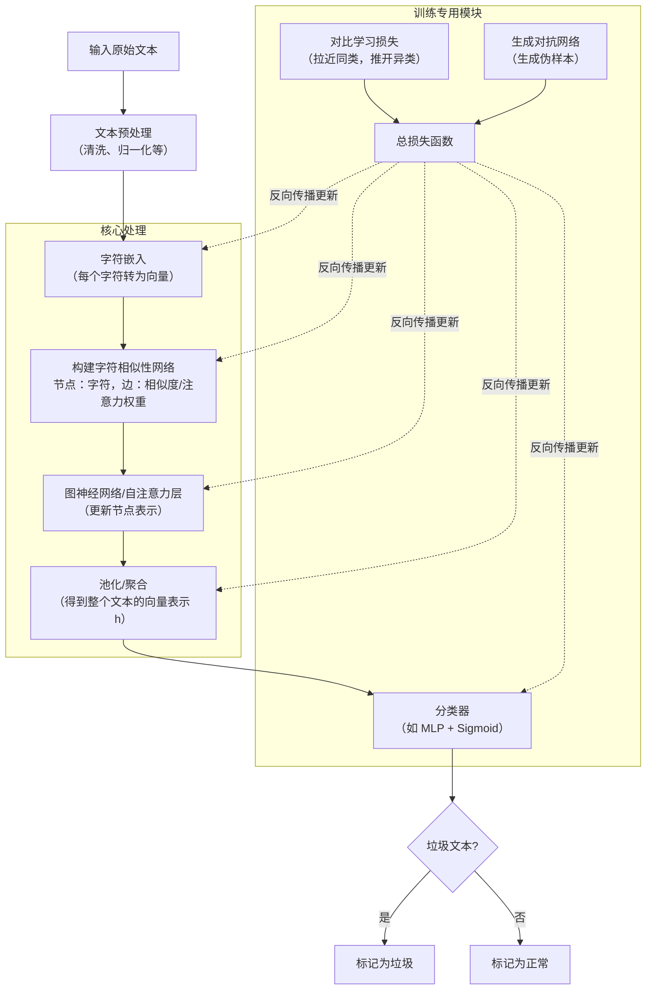

# 基于字符相似性网络的垃圾文本检测优化技术

## 字形相似性

汉字字形可以用三个要素描述：汉字结构、汉字形状和汉字笔画数。

汉字结构可分为 7 个类别：

1. 上下结构：常见的有思、歪、冒、安、全……

2. 上中下结构：常见的有草、暴、意、竟、竞……

3. 左右结构：常见的有好、棚、和、蜂、滩、往、明……

4. 左中右结构：常见的有谢、树、倒、搬、撇、鞭、辩……

5. 全包围结构：常见的有围、囚、困、回、因、国、固……

6. 半包围结构：常见的有包、区、闪、这、句、函、风……

7. 其他结构：常见的有噩、兆、非、品、森、焱、晶……

一个汉字的形状可以用四角编码来描述：

1. 四角编码是一种用于描述汉字形状和笔画的编码系统，它将汉字的形态按照笔画的先后顺序划分为若干部首，并为每个部首分配一个特定的四角编号，用最多 5 个阿拉伯数字来对汉字进行归类。这种编码系统有助于汉字的检字、输入和检索。

2. 以汉字“辉”为例，它的 5 位四角编码可能表示为“97256”(具体编码规则可能因系统或标准的不同而相异)：

汉字笔划数：

由于汉字笔画数在字形编码中只占一位，但存在大量笔画数大于 9 的汉字，因此在进行汉字笔画数的编码时需要使用 Python 中的字典数据结构来进行笔画数和编码之间的映射：

### **基于字形编码的字形相似性**

字形编码由结构分类、四角编码（5 位）和笔画数分类组成，共 7 位。

定义两个汉字 $c_i$ 和 $c_j$ 的字形相似度为 $ \text{sim}_g(c_i,c_j) \in [0,1] $：
$$
\text{sim}_g(c_i, c_j) = 0.3 \nabla g_1 + 0.6 \cdot \frac{\sum_{k = 2}^6 \nabla g_k}{5} + 0.1 \nabla g_7
$$

其中：
$$
\nabla g_k =
\begin{cases}
1, & g_k(c_i) = g_k(c_j) \\
0, & \text{其他}
\end{cases}
$$

- 结构分类（$\nabla g_1$）判断两个汉字的基本结构是否相同

- 四角编码（$\frac{\sum_{k=2}^6 \nabla g_k}{5}$）为 5 位四角编码中，相同位的占比，取值 0~1 
- 笔画数分类（$\nabla g_7$）判断两个汉字的笔画数分类是否相同

系数 0.3、0.6、0.1 是结合主观经验和模型效果后确定的，字形最为重要，其次是结构，最后是笔画。

## 字音相似性

### 字音四要素

汉字字音可以直接用四个要素概括：声母、韵母、补码以及声调

- 声母：b、p、m、f、d、t、n、l、g、k、h、j、q、x、zh、ch、sh、r、z、c、s、y、w。

- 韵母：a、o、e、i、u、ü、ai、ei、ui、ao、ou、iu、ie、üe、er、an、en、in、un、ün、ang、eng、ing、ong。

- 补码：通常用于声母和韵母之间还有一个辅音的情况，如 guang。

- 声调：阴平声、阳平声、上声、去声。

### 基于字音编码的字音相似性

字音编码直接采用声母、韵母、补码以及声调的分类组合作为 4 位编码。

定义基于字音编码的字音相似性 $\text{sim}_p(c_i,c_j) \in [0,1]$： 
$$
 \text{sim}_p(c_i, c_j) = 0.4\nabla p_1 + 0.4\nabla p_2 + 0.1\nabla p_3 + 0.1\nabla p_4
$$

$$
 \nabla p_k = \begin{cases} 1, & p_k(c_i) = p_k(c_j) \\ 0, & \text{其他} \end{cases} 
$$

其中，$\nabla p_k$ 是根据汉字的拼写进行编码的，包括声母、韵母、补码和声调。

在上式中，最重要的是声母和韵母，补码以及声调都是次要的。

## 字符相似性网络

基于字形相似性和字音相似性构建汉字相似度公式，计算两个汉字之间的相似度，类比用户对变体汉字的联想过程。

提前计算汉字库中所有汉字两两之间的相似度，一旦有新的对抗垃圾文本出现，模型也能根据字形和字音构建的相似度信息对汉字进行“联想”，从而识别其语义。

定义两个汉字 $c_i$ 和 $c_j$ 的相似性如下： 
$$
 \text{sim}(c_i, c_j) = \max\left(\text{sim}_g(c_i, c_j), \text{sim}_p(c_i, c_j)\right) 
$$
在上式中，$\text{sim}(c_i, c_j)$ 表示汉字 $c_i$ 和 $c_j$ 的总体相似性；$\text{sim}_g(c_i, c_j)$ 表示汉字 $c_i$ 和 $c_j$ 的字形相似性；$\text{sim}_p(c_i, c_j)$ 表示汉字 $c_i$ 和 $c_j$ 的字音相似性。

在处理字形相似性和字音相似性时，选择 max 聚合，而不是平均聚合或加权聚合。这是因为在实际应用中，大部分变体都只简单地考虑字形或字音的其中一个角度，并不会采取两者的结合。

---

基于字符相似性网络的垃圾文本检测，其整体流程可以清晰地分为**训练**和**推理**两个阶段。下面我们以具代表性的 **GCC-Spam** 模型为例，来串联整个流程。

### 整体架构流程图

### 阶段一：训练阶段（学习如何检测）

这是模型学习垃圾文本模式的过程。

1.  **输入与预处理**
    -   **输入**：一批已标注好的文本数据（垃圾/正常）。
    -   **预处理**：对文本进行清洗，例如移除或替换常见的干扰符（如将 `$h!t` 中的 `!` 处理掉，或将统一字符归一化）。

2.  **字符级嵌入**
    -   将预处理后的文本拆分成**独立的字符**序列（包括字母、数字、标点等）。
    -   每个字符通过一个**嵌入矩阵**（可随机初始化或使用预训练的字符向量）映射成一个稠密向量，作为该字符的初始特征。

3.  **构建字符相似性网络**
    -   将文本表示为一个**图（Graph）**：图中的**节点**是每个字符，**边**表示字符之间的关联。
    -   边的权重或注意力系数，通常通过**自注意力机制**（Self-Attention）计算得出。例如，模型会学习字符 `"V"` 和字符 `"信"` 之间应该有一条高权重的边，因为它们共同构成了一个敏感的垃圾模式。
    -   这样，整个文本就变成了一个带有权重的、有向或无向的图。

4.  **图神经网络/注意力层进行节点更新**
    -   使用图神经网络（GNN）或多头自注意力层，对图中的每个节点（字符）进行信息聚合。
    -   每个字符会**聚合其邻居节点**（即与它关联强的其他字符）的信息，结合自己的特征，更新自己的向量表示。经过这一层，字符 `"V"` 的向量中就已经包含了 `"信"` 的信息。

5.  **池化得到文本向量**
    -   经过多层更新后，得到所有字符的最终向量表示。为了得到一个代表整个文本的**定长向量**，需要进行池化操作（如求和、平均、或使用一个特殊的 `[CLS]` 节点的输出）。

6.  **分类与损失计算（含辅助技术）**
    -   将得到的文本向量输入一个**分类器**（如MLP + Sigmoid），输出一个0-1之间的垃圾概率。
    -   **核心训练目标**：模型的训练由**多个损失函数**共同指导：
        -   **分类损失**：标准的交叉熵损失，衡量模型对真实标签的预测是否准确。
        -   **对比学习损失**：让同类文本（垃圾与垃圾）的向量在空间中更接近，异类文本（垃圾与正常）的向量相互远离。这大大增强了模型的泛化能力。
        -   **生成对抗网络损失**（可选，如GCC-Spam）：一个生成器不断创造新的、伪装的垃圾样本，而判别器（即主模型）则学习识别它们。两者相互博弈，共同进化，使模型能应对未见过的变体。

### 阶段二：推理阶段（使用模型进行检测）

这是模型在实际应用中判断新文本的过程。

1.  **对新文本进行预处理**
2.  **字符嵌入**
3.  **构建字符相似性网络**
4.  **图神经网络/注意力层更新节点**
5.  **池化得到文本向量**
6.  **分类判定**：将文本向量输入训练好的分类器，得到一个垃圾概率分数（例如 0.95）。将该分数与预设的阈值（如 0.5）比较，若超过则判定为**垃圾文本**，否则为**正常文本**。

### 总结：关键特点

-   **全程无分词，无词嵌入**：处理单元始终是**字符**。
-   **图结构动态构建**：每个文本的图结构都是根据其自身字符间的关系动态生成的，不是固定的。
-   **多任务联合优化**：分类、对比学习、GAN共同训练，而非单独训练。

希望这个流程梳理能帮助你更好地理解整个模型。如果有某个环节（例如对比学习的具体计算公式，或GNN如何更新节点）需要更深入的说明，可以随时提出。

好的，我们来详细拆解这两个核心问题。为了更清晰，我会先讲自注意力如何计算权重，然后分别讲使用**图神经网络（GNN）** 和**多头自注意力层**两种方式进行信息聚合。

---

## 一、通过自注意力机制计算字符间的权重

在字符相似性网络中，每个字符是一个节点。自注意力机制的目的就是**计算每对字符之间的关联强度**（权重），表示“在当前文本上下文中，字符 i 和字符 j 有多大的关系”。

### 1. 输入准备
假设一个文本有 \(n\) 个字符，每个字符的初始向量来自嵌入矩阵，维度为 \(d\)。我们把这些向量拼成一个矩阵 \(X \in \mathbb{R}^{n \times d}\)。

### 2. 线性变换得到 Query、Key、Value
通过三个可学习的权重矩阵 \(W_Q, W_K, W_V \in \mathbb{R}^{d \times d_k}\)（\(d_k\) 通常小于或等于 \(d\)），对每个字符向量进行线性变换：
\[
Q = X W_Q, \quad K = X W_K, \quad V = X W_V
\]
其中 \(Q, K, V \in \mathbb{R}^{n \times d_k}\)。  
- **Query (查询)**：表示当前字符“想”去关注别的字符的意图。  
- **Key (键)**：表示当前字符“能够”被别的字符关注的内容。  
- **Value (值)**：表示当前字符的“实际信息”，聚合时会用到。

### 3. 计算注意力权重（相似度分数）
对于字符 \(i\) 和字符 \(j\)，我们计算 Query\(_i\) 与 Key\(_j\) 的点积，表示 i 对 j 的关注度：
\[
\text{score}_{ij} = \frac{Q_i \cdot K_j^\top}{\sqrt{d_k}}
\]
分母 \(\sqrt{d_k}\) 是缩放因子，防止点积过大。  
对所有 \(j\) 计算后，用 **Softmax** 归一化，得到最终权重 \(\alpha_{ij}\)：
\[
\alpha_{ij} = \frac{\exp(\text{score}_{ij})}{\sum_{k=1}^{n} \exp(\text{score}_{ik})}
\]
- **\(\alpha_{ij}\) 就是字符 i 对字符 j 的注意力权重**，表示 j 的信息对 i 的重要性。通常 \(0 \le \alpha_{ij} \le 1\)，且 \(\sum_{j} \alpha_{ij} = 1\)。

### 4. 基于权重的输出
字符 \(i\) 的新表示是它关注到的所有字符的 Value 向量的加权和：
\[
\text{Attention}(Q_i, K, V) = \sum_{j=1}^{n} \alpha_{ij} V_j
\]
这样就可以让每个字符聚合到与其最相关的其他字符的信息。

> **在字符相似性网络中**，这个权重矩阵 \(\alpha\) 就可以视为“字符相似性图”的**邻接矩阵**（边的权重）。这样一来，图不再根据固定的规则（如共现窗口）构建，而是由自注意力动态生成，更能捕捉非局部的依赖关系。

---

## 二、对图中每个节点进行信息聚合

获得权重（即图结构）之后，需要更新节点的表示，让每个节点融合邻居的信息。这可以通过**图神经网络（GNN）** 或**多头自注意力层**来实现。两者本质都是在图上做消息传递，但实现方式不同。

### 方法A：使用图神经网络（GNN）进行聚合

GNN 的核心是**邻居聚合**和**更新**函数。以**图卷积网络（GCN）** 为例，标准的层更新公式为：
\[
H^{(l+1)} = \sigma\left( \tilde{D}^{-\frac{1}{2}} \tilde{A} \tilde{D}^{-\frac{1}{2}} H^{(l)} W^{(l)} \right)
\]
但在字符相似性网络中，图通常是有权重的（边权重为 \(\alpha_{ij}\)），且每个节点有自己的特征。更直观的**消息传递**写法如下：

对于节点 \(i\)，在第 \(l\) 层的表示是 \(h_i^{(l)}\)。下一层的计算分两步：

1. **聚合邻居信息**：
   \[
   m_i^{(l+1)} = \sum_{j \in \mathcal{N}(i)} \alpha_{ij} \cdot h_j^{(l)}
   \]
   其中 \(\alpha_{ij}\) 就是上一步算出的注意力权重（也可以是 GNN 内部新算的）。\(\mathcal{N}(i)\) 包括 i 自己（自环）或所有节点（全图）。通常在字符网络中会让每个节点与所有节点相连，因为自注意力已经给了全图的权重。

2. **更新节点表示**：
   \[
   h_i^{(l+1)} = \sigma\left( W^{(l)} \cdot [h_i^{(l)} \parallel m_i^{(l+1)}] \right)
   \]
   或简单写为：
   \[
   h_i^{(l+1)} = \sigma\left( W^{(l)} \cdot m_i^{(l+1)} + b^{(l)} \right)
   \]
   其中 \(\sigma\) 是非线性激活函数（如 ReLU），\(\parallel\) 表示拼接。

经过多层 GNN，每个字符的表示会逐步包含更多跳邻居的信息，最终整个文本的语义被编码到节点特征中。

### 方法B：使用多头自注意力层进行聚合

实际上，Transformer 中的**多头自注意力**本身就是在做全连接图上的信息聚合。它的每一层可以看作一个特殊的 GNN，其中：
- 图是完全图（每个节点与所有节点相连）。
- 边的权重动态由 Query-Key 计算。
- 聚合方式就是上面讲的加权和。

**多头机制**：使用多组不同的 \(W_Q, W_K, W_V\)，并行计算多个注意力（每个头关注不同的关系模式），然后将各头的输出拼接（或求和）后再通过一个线性变换：
\[
\text{MultiHead}(X) = \text{Concat}(\text{head}_1, ..., \text{head}_h) W_O
\]
每个 head 的计算就是前面单头注意力的过程。

**层结构**：通常一个 Transformer 层包含：
1. 多头自注意力子层（做节点间信息聚合）
2. 前馈网络子层（对每个节点的表示做非线性变换）
3. 残差连接 + 层归一化

这样，每个字符的表示在每一层之后都聚合了全局所有字符的信息，而且权重是自适应计算的。

---

### 🔍 两者对比与选择

| 特性                   | GNN（如 GCN、GAT）                          | 多头自注意力（Transformer 层）             |
| :--------------------- | :------------------------------------------ | :----------------------------------------- |
| **图结构**             | 可以是预定义的稀疏图（如 k 近邻）或完全图   | 总是完全图，但权重由注意力动态计算         |
| **权重计算**           | 可固定（邻接矩阵）或由注意力机制（GAT）计算 | 始终由 Query-Key 点积计算                  |
| **计算复杂度**         | 若图稀疏，较低；若完全图，\(O(n^2 d)\)      | 总是 \(O(n^2 d)\)（但多头增加常数倍）      |
| **长距离依赖**         | 需要多层才能捕获远距离节点                  | 单层即可捕获所有节点对                     |
| **在字符网络中的使用** | 常用于强调局部关系的任务（可限制邻居范围）  | 更适合字符级任务，因为所有字符都应平等考虑 |

### 💡 实际模型中的常见做法

在 **GCC-Spam** 这类模型中，通常混合使用：
1. **先用自注意力机制计算字符间的相似度权重**（作为图结构）。
2. **再将这个带权图输入到多层 GNN 中**（例如图同构网络 GIN 或图注意力网络 GAT），进行多轮消息传递。
3. 也有的模型直接用**堆叠的多头自注意力层**（即 Transformer）完成所有聚合，不再单独分“建图”和“GNN”两步。

---

## 三、一个具体的小例子

假设句子：`"V信"` （两个字符，嵌入维度 d=4）。

1. 字符嵌入：  
   \( h_V = [0.2, 0.5, 0.1, 0.4] \)  
   \( h_信 = [0.3, 0.6, 0.2, 0.5] \)

2. 自注意力计算权重：  
   经过 \(W_Q,W_K\) 得到 Q、K（假设 d_k=2），点积后 softmax 得到 \(\alpha_{V\to V}=0.6, \alpha_{V\to 信}=0.4\)；同理 \(\alpha_{信\to V}=0.3, \alpha_{信\to 信}=0.7\)。

3. 信息聚合（单头注意力）：  
   新 \(h_V' = 0.6 \cdot V_V + 0.4 \cdot V_信\)  
   新 \(h_信' = 0.3 \cdot V_V + 0.7 \cdot V_信\)

4. 如果再加一个 GNN 层，会将 \(h_V'\) 和 \(h_信'\) 作为输入，再对邻居（此时所有节点互连，权重可以用注意力重新计算，也可以用刚才的 \(\alpha\)）做一次加权和 + 非线性变换，得到更深层的表示。

---

希望这个拆解对你有帮助。如果还有不清楚的数学细节（比如梯度如何传播、多头拼接后的维度变化等），可以继续提问。

